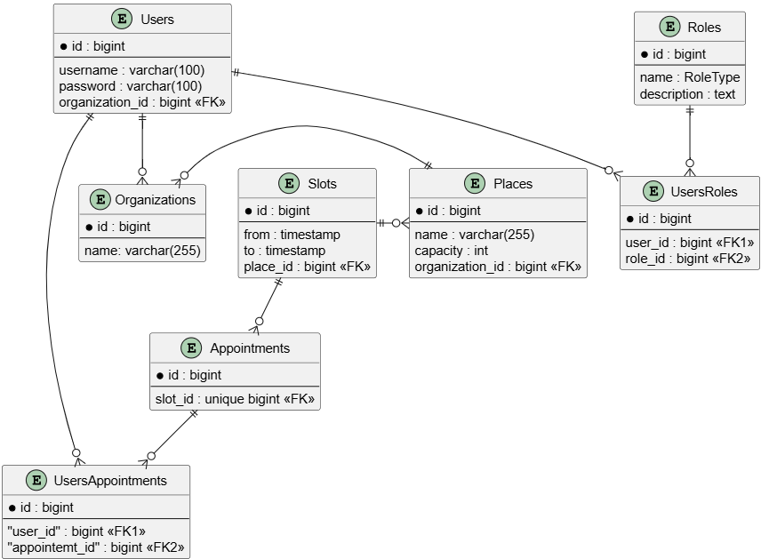

## Appointment Scheduling System

Appointment Scheduling System - pet-проект - сервис для планирования встреч

### Функционал

* Создание организаций и мест проведений встреч, получение и удаление их по id, получение всех сущностей 

* Создание слотов. Слот привязан к месту проведения встреч. Проверяется отсутствие временных пересечений. Можно создать один слот, указав время начала и окончания, или несколько одинаковой продолжительности, указав время начала первого слота, количество слотов и их продолжительность

* Получение и удаление слотов по id, получение всех слотов или только свободных

* Регистрация и логин пользователей

* Создание встречи. Встреча привязана к слоту

* Добавление/удаление пользователя в список участников встречи

### ERD

### Технологии и описание решения

* **ASP.NET MVC**
* **Entity Framework** - ORM
* **Postgres**, **Docker** - развертывание контейнера с БД
* **JWT**
    * Эндпоинты защищены.
    * При успешном логине пользователю возвращается jwt-токен (access), который нужно передавать в заголовке Authentication. 
    * У пользователя есть роли (User, Manager, SeniorManager, Admin). Роль влияет на возможность обращения к эндпоинту, а также на возвращаемые данные
* **AutoMapper** - преобразование DTO в модели и наоборот
* **Swagger** - документация

### Todo

* дописать логику

* протестировать
